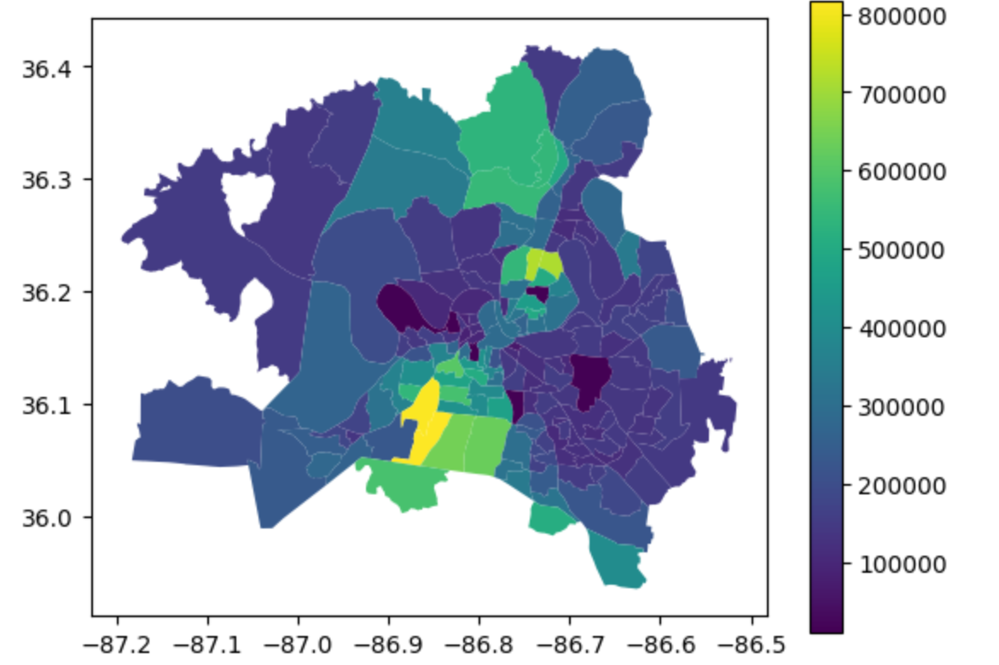
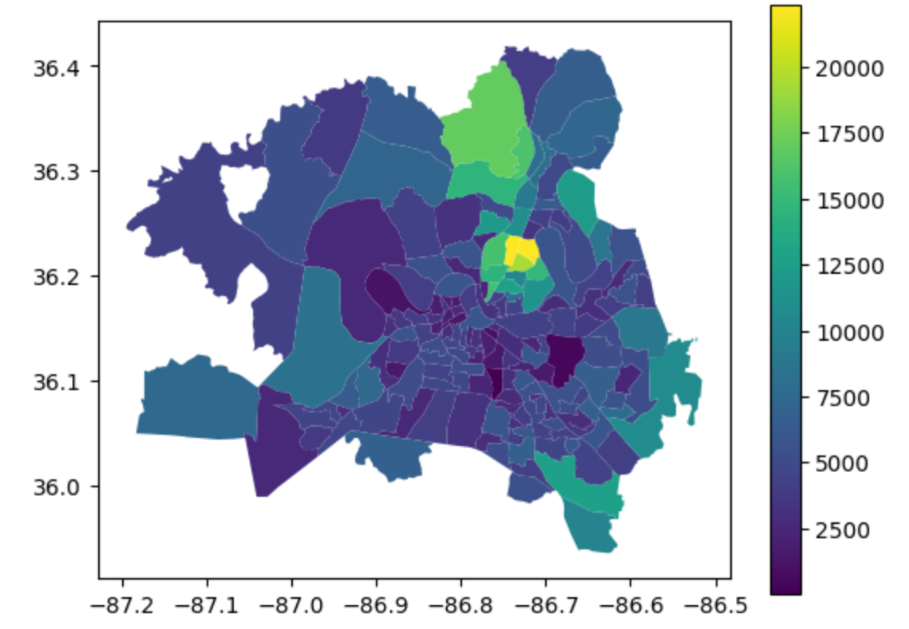

# nashville-accidents
Using Spark, AWS, and GeoPandas to analyze Nashville's emergency incidents and response times.

Used Spark, AWS EMR, and AWS Athena to join and query several large tables about Nashville's weather, traffic, and emergency incidents.
GeoPandas and Plotly were used to analyze and visualize geospatial information. SKLearn used to do regression, random forest, and boosting.

Some visualizations provided below, rest are in the report.

Average response time by census tract:

Average housing value by census tract:

Amount of people in each census tract:

Full report and visualizations in the final_report.pdf. 
